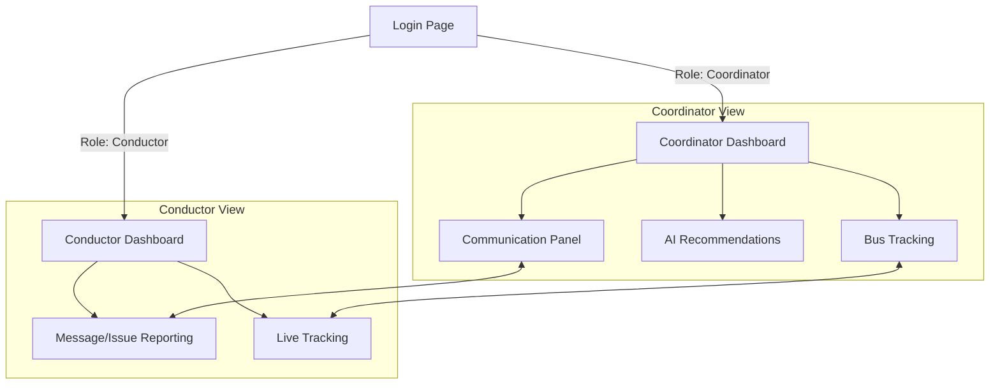

# RouteSaathi – BMTC Route Management System

A modern, responsive web application to streamline **Bengaluru Metropolitan Transport Corporation (BMTC)** route management. Designed for both **coordinators** in the control center and **bus conductors** on the field, RouteSaathi supports smarter decisions, real-time communication, and AI-driven recommendations for optimal fleet utilization.

---

## 🚩 Project Overview

**RouteSaathi** addresses the operational complexity of city bus networks by providing a unified platform for real-time monitoring, communication, and decision support.

- **Purpose:**  
  To enable BMTC coordinators and conductors to efficiently manage bus routes, respond to issues, and optimize resources.
- **Problem Solved:**  
  Eliminates fragmented communication, manual tracking, and guesswork in route assignments and fleet operations.
- **Target Users:**  
  - BMTC coordinators/dispatchers
  - BMTC conductors

### Major Features

- **Role-based Authentication** (Coordinator/Conductor)
- **Unified Dashboards** for both user types
- **Live Bus Tracking** (with GPS/mock data)
- **Direct & Broadcast Messaging** (Real-time communication)
- **AI Recommendations** for route & fleet optimization
- **Issue Reporting** (Breakdown, Traffic, Accidents, Overcrowding)

### System Architecture Overview



---

## 🗂️ Core Features

- **Authentication & Authorization:**
  - Secure, role-based login for coordinators and conductors
- **User Roles:**
  - Coordinator: Full system access, dashboards, AI, tracking, communication
  - Conductor: Assignment view, status update, issue reporting
- **Dashboards:**
  - Overview of fleet status, alerts, route performance for coordinators
  - Assignment, notifications, quick actions for conductors
- **Live Data Flows:**
  - Mock real-time GPS data, bus locations, and statuses
- **Communication:**
  - 1:1 chat and broadcast messaging (coordinator to conductors)
  - Issue and incident reporting (conductor to coordinator)
- **AI/ML Recommendations:**
  - ML-based bus reallocation and analytics
- **Data Storage:**
  - Uses browser localStorage for sessions, messages, and mock data

---

## 🛠️ Tech Stack

| Layer        | Technology                                     |
|--------------|------------------------------------------------|
| Frontend     | HTML5, CSS3 (custom design), JavaScript (ES6)  |
| Backend      | _Placeholder: Node.js/Express or similar_      |
| Database     | _Placeholder: MongoDB/PostgreSQL_              |
| Tools        | Git, GitHub, VSCode, LocalStorage (browser),   |
|              | [Mermaid.js](https://mermaid-js.github.io/) for diagrams |

---

## 📁 Folder Structure

```plaintext
project/
   frontend/
      pages/
         index.html
         login.html
         dashboard-coordinator.html
         dashboard-conductor.html
         tracking.html
         ai-recommendations.html
         communication.html
      assets/
         karnataka-emblem.png
         bmtc-logo.png
         bangalore-map.png
         map-placeholder.png
      css/
         style.css
      js/
         login.js
         coordinator.js
         conductor.js
         tracking.js
         ml.js
         communication.js
      README.md
   backend/
      (future server, API, database code here)
   LICENSE
```

---

## 📦 Installation Instructions

**1. Clone the repository**

```bash
git clone https://github.com/yourusername/routesaathi.git
cd routesaathi/frontend
```

**2. Add Images**

Place the required logo images in `assets/` as described in the documentation.

**3. Run Locally**

- **Option A: Using Live Server (Recommended)**
  1. Install "Live Server" extension for VSCode
  2. Right-click `index.html` → Open with Live Server

- **Option B: Using Python**

    ```bash
    python -m http.server 8000
    # Visit http://localhost:8000
    ```

- **Option C: Using Node.js**

    ```bash
    npx http-server
    # Visit http://localhost:8080
    ```

- **Option D: Direct File Opening**

  - Double-click `login.html` (some features may be limited)

---

## 🚀 Usage Guide

### Coordinator Workflow

1. **Login** as Coordinator (username: `coordinator`, password: `coord123`)
2. Access the **Dashboard** for a real-time overview
3. Use **Track Bus Routes** to monitor live bus locations
4. Review **AI Recommendations** for route adjustments
5. Communicate with conductors via **Communication** panel (1:1 or broadcast)

### Conductor Workflow

1. **Login** as Conductor (username: `conductor`, password: `cond123`)
2. View **Today's Assignment** and real-time bus info
3. Receive notifications from the coordinator
4. **Report Issues** (breakdown, traffic, etc.) or send messages
5. Share your live location (mock GPS)

#### Example Screens

> Coordinator Dashboard  
>   

> Conductor Panel  
> 

---

## 🔗 API / Future Backend

_Planned API endpoints (not implemented yet)_

- **Auth API:**  
  `/api/auth/login` — User authentication, session management

- **Communication API:**  
  `/api/messages` — Chat, broadcast, issue reporting

- **ML API:**  
  `/api/ai/recommendations` — Fetch AI/ML route suggestions

- **Tracking API:**  
  `/api/buses` — GPS/live status, fleet monitoring

---

## 🤝 Contribution Guidelines

- **Branching:**  
  Use `main` for stable, release-ready code. Create feature branches: `feature/<name>`.

- **Commit Messages:**  
  Use clear messages: `feat: add AI recommendations table`, `fix: logout bug on dashboard`.

- **Pull Requests:**  
  - Reference issue numbers
  - Describe changes clearly
  - Request review

- **Issues Template:**
  - Steps to reproduce
  - Expected vs actual behavior
  - Screenshots (if possible)

---

## 📄 License

**Proprietary Software**  
(Contact BMTC for production use or redistribution rights.)

---

## 🏅 Badges


---

## 🙋 Contact, Credits & Acknowledgments

- **Contact:**  
   avdhesh.ghansela@gmail.com

- **Credits:**  
  - BMTC IT Team, Government of Karnataka  
  - Contributors & volunteers

- **Acknowledgments:**  
  Thanks to all open-source libraries and the BMTC staff for domain knowledge.

---

**Built for Mintathon Hackathon Project | 2025**
